# I. INTRODUCTION

In this project, we want to construct a music style converter that can use machine learning algorithms to perform style conversions for the input  MIDI music.  We chose jazz music as a goal of conversion. The overall thinking is as follows:

First, select 800 jazz to build the original data set, and divide the data set into three parts: 

|Folder|Songs|
|:--:|:--:|
|train|600|
|dev|50|
|test|150|

Then, use music21 to extract information from the original MIDI song and retrieve its track information to save in the txt file.

Next, for the track information in each txt file, split it and get the chord and note sperately, save these two information in different files. This step is done for all folders. 

Finally we get six files: 

train.chord, train.note, dev.chord, dev.note, test.chord, test.note.

After that, we will use Tensorflow NMT to accomplish the training process. We regard the chord file as the source sequence while the note file as the target sequence. Based on this, the NMT will be trained to accomplish the chord to note transfermation. Since the target notes are collected from jazz songs, if we input a new song's chord file, the NMT will search the corresponding　jazz note to combine the jazz-style note file. Thus, by using the input song and the jazz-style note file, we can generate a new song with jazz style based on music21's functions.

# II. REQUIREMENTS

## 2.1 Data Processing

### 2.1.1 Music21

[Music21](http://web.mit.edu/music21/) is a set of tools for helping scholars and other active listeners answer questions about music quickly and simply. 

Music21 is very useful in processing the MIDI music. [MIDI](https://en.wikipedia.org/wiki/MIDI) (Musical Instrument Digital Interface) is a technical standard that describes a communications protocol, digital interface, and electrical connectors that connect a wide variety of electronic musical instruments, computers, and related music and audio devices. A single MIDI link can carry up to sixteen channels of information, each of which can be routed to a separate device.

In this project, we mainly use music21 to extract the information in MIDI files. This useful package can help us to extract the track, chord and note information for the input MIDI, and can also use these information to generate a new song.

## 2.2 Model Training

### 2.2.1 Neural Machine Translation (seq2seq) 

Tensorflow [NMT](https://github.com/tensorflow/nmt)(Neural Machine Translation) is a Sequence-to-sequence (seq2seq) model which can help us enjoy great success in a variety of tasks such as machine translation, speech recognition, and text summarization. 

The advantage is that this model is well designed by Google, thus we can train it easily by providing the source sequence and the target dequence with some model structure parameters.

### 2.2.2 Deep Learning Environment

Since training NMT requires enough data processing ability, we need to build a deep learning environment for model training. To increase the training speed, it's better to use GPU in this process.

The necessary packages for building the deep learning environment:

|Name|Version|
|:--:|:--:|
|GPU|Nvidia GTX1070|
|[CUDA](https://developer.nvidia.com/cuda-downloads)|9.0|
|[cuDNN](https://developer.nvidia.com/cudnn)|7.0|
|[Tensorflow](https://www.tensorflow.org/?hl=zh-cn)|1.7-gpu|

## 2.3 Visualization

### 2.3.1 TensorBoard

[TensorBoard](https://www.tensorflow.org/programmers_guide/summaries_and_tensorboard) is used to visualize the TensorFlow graph, plot quantitative metrics about the execution of the graph, and show additional data like images that pass through it. The main page of it looks like:

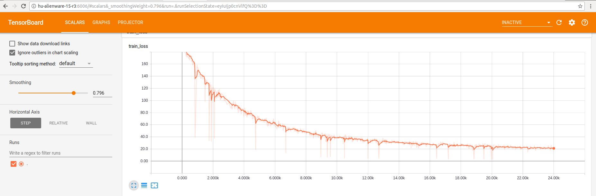

We can use the command below to open TensorBoard:

    tensorboard --logdir=/home/hu/桌面/7404-GroupA/nmt/tmp/model-data-4/train_log --port 4004
    
logdir is the path of the NMT log file and port will set the port to show the web UI(the default port is 6006)

### 2.3.2 MuseScore

[MuseScore](https://musescore.com/dashboard) is a free scorewriter for Windows, macOS, and Linux, comparable to Finale and Sibelius, supporting a wide variety of file formats and input methods. It is released as free and open-source software under the GNU General Public License.

For Ubunutu16.04, the UI looks like:

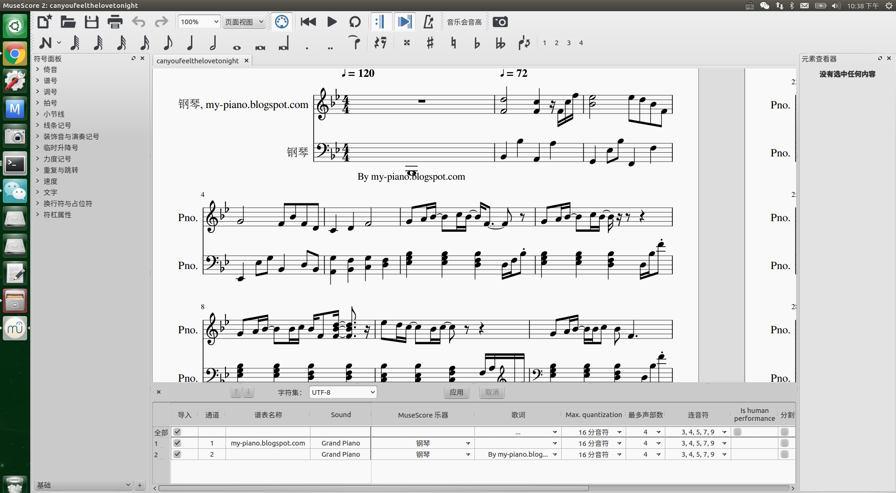

# III. THEORY

## 3.1 Data Process

## 3.2 NMT

# IV. EXPERIMENTS

## 4.1 Parameter Choice

In this part, we've tried different parameter combinations to verify the training results.

***Choice***

1. Note processing method:

There are two possible methods to extract notes information:

The first one, all-information: extract the note information with its duration information(such as **F#4-flat-ninth_pentachord**).

The second one, single-information: only extract the note information(such as **F#4**).

2. num_train_steps:

We've tried three different values of **num_train_steps**: 12000, 24000 and 50000.

3. num_units:

We've tried two different values of **num_units**: 128 and 256.

***ATTENTION***

***If you want to set the num_units larger, please make sure that your device is good enough. If you do not have a gpu or the gpu memory is not enough, please reduce the num_units to avoid out of memory error!***

## 4.2 Experiments
### Experiment1

|Note|num_train_steps|num_units|
|:--:|:--:|:--:|
|All-Information|12000|128|

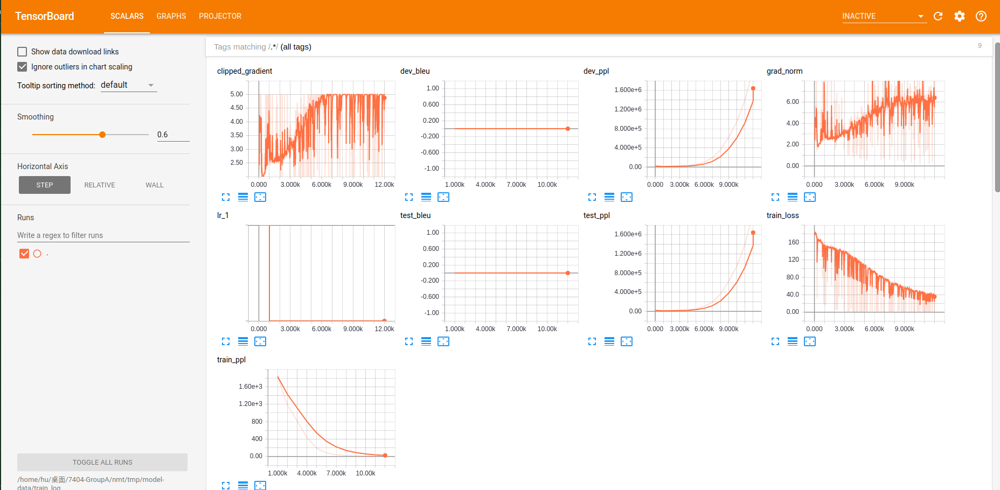

### Experiment2

|Note|num_train_steps|num_units|
|:--:|:--:|:--:|
|All-Information|24000|128|

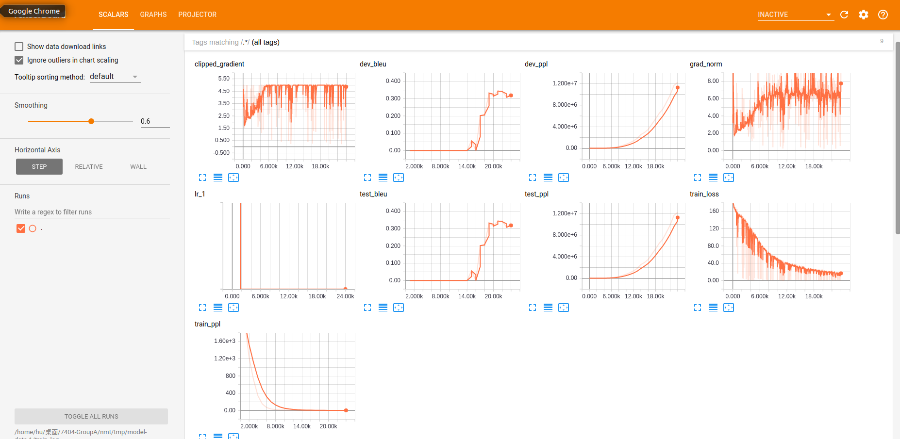

### Experiment3

|Note|num_train_steps|num_units|
|:--:|:--:|:--:|
|All-Information|50000|128|

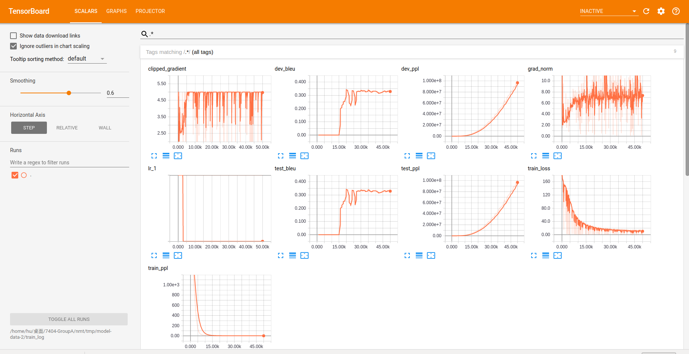

### Experiment4

|Note|num_train_steps|num_units|
|:--:|:--:|:--:|
|Single-Information|24000|128|

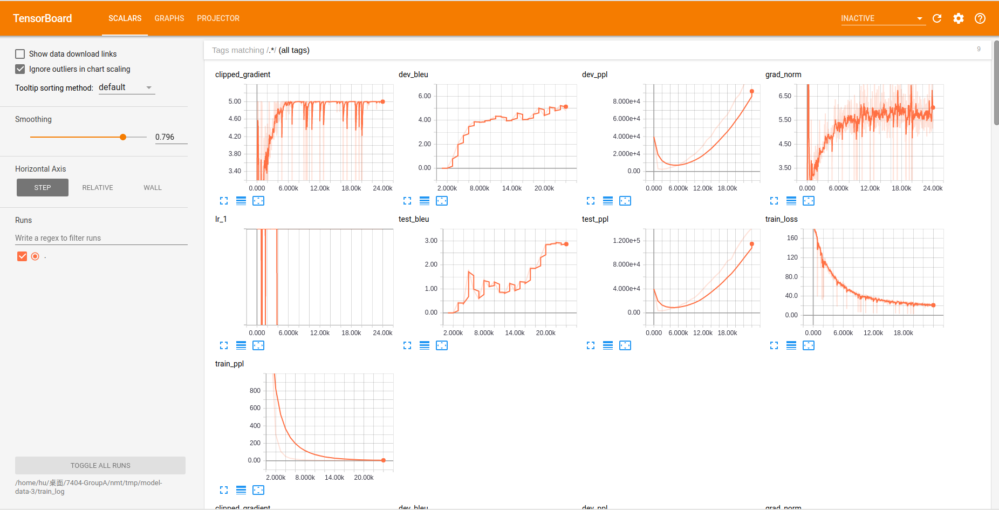

### Experiment5

|Note|num_train_steps|num_units|
|:--:|:--:|:--:|
|Single-Information|24000|256|

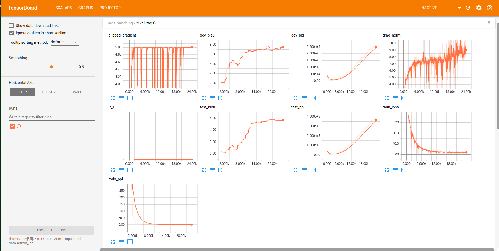

### Experiment6

|Note|num_train_steps|num_units|
|:--:|:--:|:--:|
|Single-Information|50000|512|

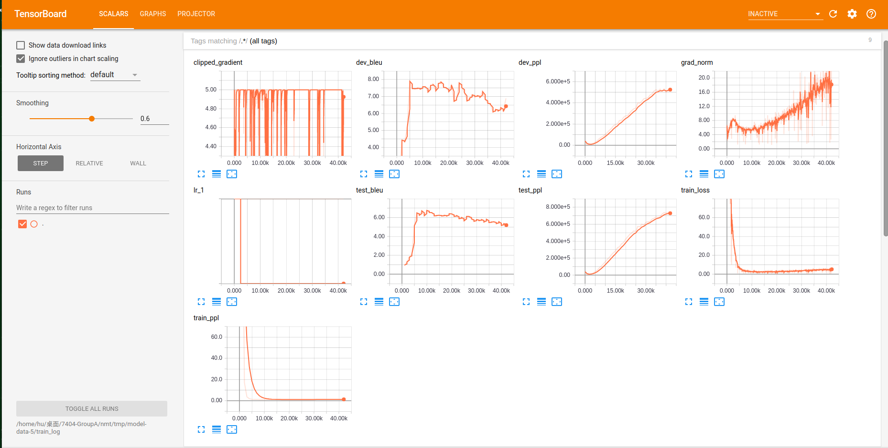

## 4.3 Results

In our experiment, we use [BLEU](https://en.wikipedia.org/wiki/BLEU) value and train loss value to evalute the models.

|Experiment|Note|num_train_steps|num_units|dev_bleu|test_bleu|train_loss|
|:--:|:--:|:--:|:--:|:--:|:--:|:--:|
|1|All-Information|12000|128|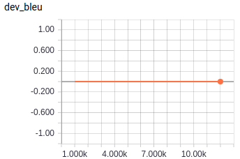|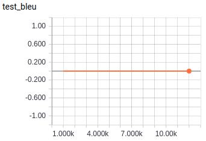|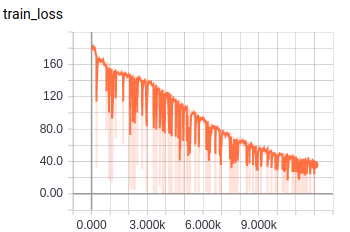|
